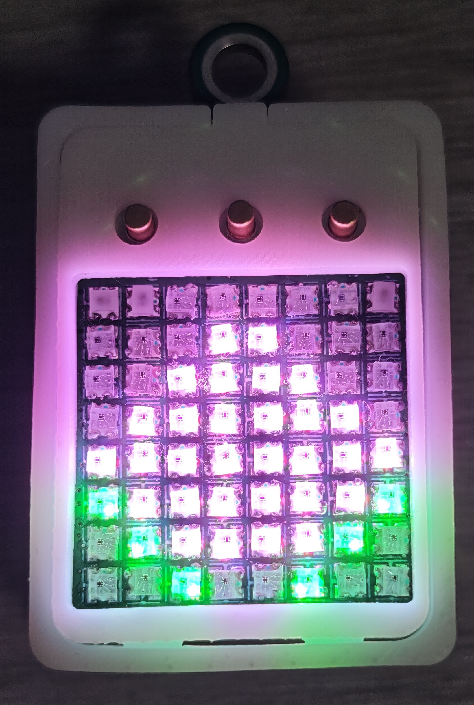

# 基于Air001的彩灯钥匙扣

<h1 style="margin-bottom:0.5em"><strong>个人主页</strong></h1>

<a href="https://space.bilibili.com/106438109">B站-沈已成</a> 
<a href="https://github.com/Eason-SYC">Github-Eason-SYC</a>

<h1 style="margin-bottom:0.5em"><strong>💌 项目介绍</strong></h1>

这不仅是一个可以亮灯的钥匙扣，还实现了炫酷的动画效果，你甚至可以在上面玩游戏！

该项目基于极具性价比的Air001芯片，整体尺寸（含3D外壳）仅有**2.5cm * 3.5cm**，小巧便携，软件基于 Arduino IDE 开发，拥有极低的入门门槛，代码结构清晰，对初学者和小白非常友好。

* 硬件成本低，将更多的注意力放在了软件上。它不仅仅可以亮灯，还实现了炫酷的动画效果，甚至可以在上面玩游戏。

* 小巧便携，该钥匙扣的大小仅为2.5cm * 3.5cm（包含3D外壳）

* 电源管理：精确检测电池电量，而且充电可触发充电动画

* 二次开发：资料完善，软硬件全开源，喜欢什么图案可以自己DIY设计，非常浪漫的礼物

  

# **🕹 项目功能**

<h2 style="margin-top:0"><strong>💡 动画效果</strong></h2>

* 火焰效果：实现动态逼真的火焰燃烧效果。
* 流星雨：随机生成颜色各异的流星，带有优雅的拖尾渐隐效果。
* 彩虹渐变：丝滑的全屏彩虹渐变，色彩过渡自然，且性能经过优化。
* 彩虹心形：在正确的心形图案上实现整体彩虹色的平滑呼吸渐变。
* 跳动的心：经典的大小交替心形图案，模拟心跳效果。

  
  &nbsp;&nbsp;&nbsp;&nbsp;
  

## **🎮 复古游戏 (Game)**

* 动态菜单图标：所有游戏在选择菜单中都设计了独特的动态Logo
* 贪吃蛇 (Snake)：经典的贪吃蛇游戏，支持四向控制，详细操作方法参照 **使用手册** 章节
* 弹珠游戏 (Pinball)：可控制的挡板，物理反弹的小球，每次被挡板反弹后小球都会加速
* 生命游戏 (Game of Life)：康威生命游戏的经典模拟，可作为一种程序化的屏保。

  

## **🖼️ 静态图片 (Picture)**

内置多种像素画

* 修猫
* 桃子
* 爱心
* 小鸭
* 剑
* 修勾

  
  

## **🆎 字母 (Letter)**

显示26个字母

  

## **🔢 数字 (Letter)**

显示10个数字

  

## **🔧 工具 (Tool)**

* 亮度调节：支持五级亮度调节，拥有直观的UI界面。
* EEPROM掉电保存：亮度设置后会自动保存在EEPROM中，断电重启后无需重新设置。

  

## **🔋 电源管理 (Power Management)**

* 电量检测：ADC电池检测电路。
* 充电动画：基于硬件引脚状态变化检测，接入USB即显示充电动画。
* 电量显示：在非游戏状态下，可随时通过左右组合键查看当前电量，不同电量等级对应不同电量格数。

  
  &nbsp;&nbsp;&nbsp;&nbsp;
  

